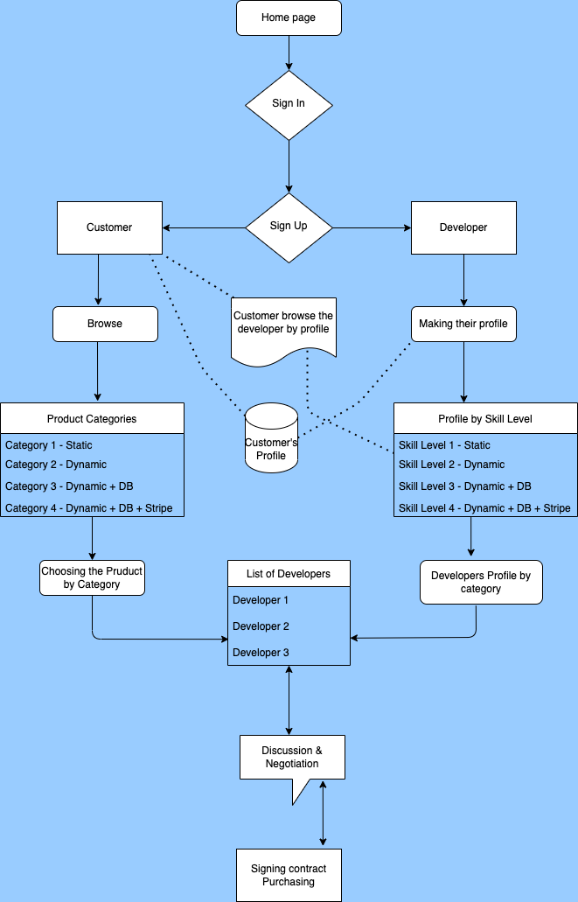

# Hire a Developy 

## User Story

As a Customer who wants to get a Web site done by a professional Web Developer

I WANT TO be able to find a Web site where I can find a Web developer according to the level of technology,

SO THAT I can find a Developer according to their skill level.

WHEN I visit the level of technology,

I WOULD BE able to find a Web Developer who has a skill of that technology.

IF I WANT TO check the Web Developer's profile,

THEN I can visit their profile and see their portfolio.

IF I WANT TO go ahead with the particular developer,

I WOULD BE able to inquire and offer the contract.

# Introduction

"Hire A Developy" is a Web Solution services providing web site. It is an E-Commerce website where customer can find a developer without any intermediate. Customer can browse the developer's profile and find the most suitable developer according to their requirements. Customer can inquire the Web Developer and clarify details before finalized the purchase.

# Mock

  ## Structure planing
 

  ## Wire Frame

  

  ## Flow Chart

   

# Tools used
   
    🔗 MongoDB
    
    🔗 Express JS 

    🔗 REACT
    
    🔗 Node JS

    // CSS Framework

    🔗 Tailwind CSS

    // Libraries used,

    - Google (https://www.google.com/)

# Home page

# Features to be added in Future 

As we going through our work on project we realized some of the features to be added in future. 

This includes,

    - Message dashboard

    - Viewing profiles of both Customers and Developers

    - Payment option at the end of the agreement of both Customer and Developer (Using Stripe)

## Obstacles 

- Git command failures

- Git merging failures & conflicts

- Linking issues with Front end and back end

- Responsiveness issues with Tailwind CSS

- Errors and missing files when Seeding and installing 

## Authors

- Mark (Mainly Front End, Presentation)

- Chamath (Mainly Back End, README file, Presentation)

## Deployed URL

  https://chamath777.github.io/hire-a-developy/

## Github URL

  https://github.com/Chamath777/hire-a-developy

## Heroku URL

## Presentation link

⚡️ Fun fact...

Thank you for the Developers for making us Developers!